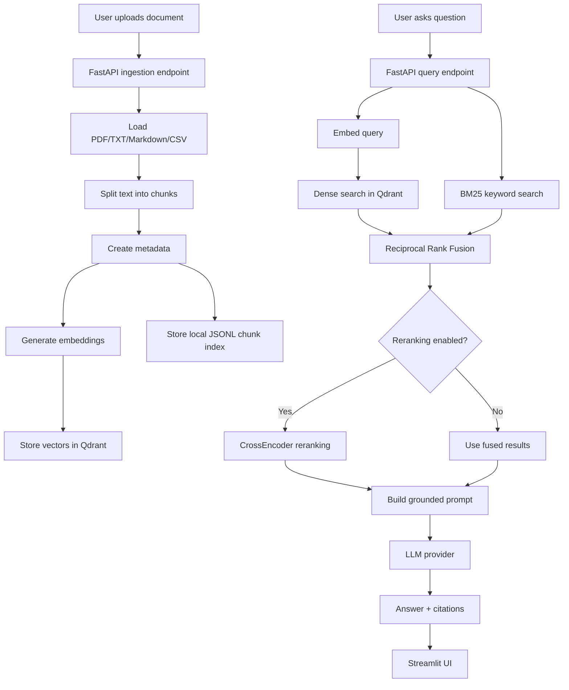

# Internal Docs RAG Assistant

**A production-style RAG application for asking grounded questions over private internal documents.**

This project lets users upload PDF, TXT, Markdown, and CSV files, index them into a Qdrant vector database, retrieve relevant document chunks using hybrid retrieval, optionally rerank results with a CrossEncoder, and generate answers with citations.

> This is a portfolio-ready project designed to be understandable for beginners while still demonstrating real AI engineering, RAG, backend, and retrieval concepts.

---

## Screenshots

Add your screenshots here after running the project locally.

```text
docs/images/upload-screen.png
docs/images/query-screen.png
docs/images/citations-screen.png
```

## Demo GIF

Add a demo GIF here after recording the app.

```text
docs/demo/internal-docs-rag-demo.gif
```

---

## Problem Statement

Companies often have important information stored across internal documents such as handbooks, policies, onboarding guides, CSV exports, and technical notes. Searching those documents manually is slow, and using a generic chatbot can create privacy and hallucination risks.

This project solves that problem by building an internal knowledge assistant that answers questions only from uploaded documents and returns citations showing the exact chunks used as evidence.

---

## What This Project Demonstrates

This project demonstrates how to build a complete RAG system with:

- Document ingestion for PDF, TXT, Markdown, and CSV files
- Local sentence-transformer embeddings
- Qdrant vector search
- BM25 keyword search
- Hybrid retrieval using Reciprocal Rank Fusion
- Optional CrossEncoder reranking
- LLM provider abstraction for OpenAI-compatible APIs, Groq, and Ollama
- FastAPI backend
- Streamlit user interface
- Citation formatting
- Unit tests for core retrieval and schema logic
- Docker Compose for Qdrant and the API

---

## Key AI Concepts

### RAG

Retrieval-Augmented Generation is a pattern where the system retrieves relevant context from a knowledge base before asking an LLM to answer. Instead of relying only on the model's memory, the answer is grounded in documents.

### Embeddings

Embeddings convert text into numerical vectors. Similar meanings should have similar vectors. This project uses `sentence-transformers` as the default local embedding system.

### Vector Search

Vector search finds chunks that are semantically similar to the user's question. This is useful when the wording of the question is different from the wording in the document.

### BM25

BM25 is a classic keyword retrieval algorithm. It is strong when the user query contains exact terms, product names, policy names, IDs, or abbreviations.

### Hybrid Retrieval

Hybrid retrieval combines semantic vector search and keyword search. This project uses dense retrieval from Qdrant plus sparse BM25 retrieval.

### Reciprocal Rank Fusion

Reciprocal Rank Fusion combines multiple ranked result lists. A chunk that appears highly in both dense and sparse search is promoted.

### Reranking

Reranking takes the retrieved candidates and scores them again with a more precise model. This project supports optional CrossEncoder reranking.

### Citations

Citations show which document chunks were used. Each citation includes the document name, page number when available, chunk ID, and a short preview.

### Hallucination Reduction

The prompt tells the LLM to answer only from retrieved context. If the retrieved context is not enough, it must say:

```text
I could not find enough information in the uploaded documents to answer this reliably.
```

---

## Architecture



---

## Full Data Flow

1. User uploads a document through Streamlit or `POST /api/ingest`.
2. The backend saves the file under `data/uploads/`.
3. The loader extracts text:
   - PDF: PyMuPDF page extraction
   - TXT/Markdown: plain text loading
   - CSV: rows converted into readable text
4. Text is split into overlapping chunks.
5. Each chunk receives metadata:
   - document name
   - document ID
   - chunk ID
   - page number when available
   - source file path
   - created timestamp
6. The embedding model converts chunks into vectors.
7. Qdrant collection is created automatically if it does not exist.
8. Chunks and embeddings are stored in Qdrant.
9. Chunk text and metadata are also stored in a local JSONL index for BM25 and document listing.
10. User asks a question.
11. The question is embedded for dense search.
12. BM25 performs sparse keyword search over the local chunk index.
13. Dense and sparse rankings are fused with Reciprocal Rank Fusion.
14. Optional CrossEncoder reranking reorders the fused candidates.
15. The LLM receives only the retrieved context and the question.
16. The API returns the answer, citations, retrieved chunks, and retrieval/rerank scores.

---

## Tech Stack

| Layer | Tool |
|---|---|
| Language | Python 3.11+ |
| API | FastAPI |
| UI | Streamlit |
| Vector Database | Qdrant |
| Embeddings | sentence-transformers |
| Sparse Search | rank-bm25 with local fallback |
| Reranking | sentence-transformers CrossEncoder |
| PDF Parsing | PyMuPDF |
| Data Validation | Pydantic |
| HTTP Client | httpx / requests |
| Testing | pytest |
| Containerization | Docker + Docker Compose |

---

## Repository Structure

```text
internal-docs-rag-assistant/
├── app/
│   ├── api/
│   │   ├── main.py          # FastAPI app setup
│   │   └── routes.py        # API endpoints
│   ├── core/
│   │   ├── config.py        # Environment configuration
│   │   ├── document_store.py# Local JSONL chunk index
│   │   └── logging.py       # Logging setup
│   ├── ingestion/
│   │   ├── loaders.py       # PDF/TXT/Markdown/CSV loaders
│   │   ├── chunker.py       # Text splitting
│   │   └── pipeline.py      # End-to-end ingestion pipeline
│   ├── retrieval/
│   │   ├── dense.py         # Embeddings + Qdrant search
│   │   ├── sparse.py        # BM25 keyword search
│   │   ├── hybrid.py        # Reciprocal Rank Fusion
│   │   └── reranker.py      # Optional CrossEncoder reranking
│   ├── generation/
│   │   ├── llm_client.py    # LLM provider abstraction
│   │   └── prompts.py       # Grounded prompt templates
│   ├── schemas/
│   │   └── models.py        # Pydantic request/response models
│   └── utils/
│       └── citations.py     # Citation formatting
├── ui/
│   └── streamlit_app.py     # Streamlit UI
├── tests/                   # Unit tests
├── sample_data/             # Sample document
├── docker-compose.yml       # API + Qdrant services
├── Dockerfile               # API container image
├── Makefile                 # Developer commands
├── requirements.txt         # Python dependencies
├── .env.example             # Environment template
├── .gitignore
└── README.md
```

---

## Setup Instructions

### 1. Clone the repository

```bash
git clone https://github.com/your-username/internal-docs-rag-assistant.git
cd internal-docs-rag-assistant
```

### 2. Create a virtual environment

```bash
python -m venv .venv
```

Activate it:

```bash
# macOS/Linux
source .venv/bin/activate

# Windows PowerShell
.venv\Scripts\Activate.ps1
```

### 3. Install dependencies

```bash
make install
```

Or manually:

```bash
pip install -r requirements.txt
```

### 4. Create your `.env`

```bash
cp .env.example .env
```

On Windows PowerShell:

```powershell
copy .env.example .env
```

---

## Environment Configuration

The project loads configuration from `.env`.

| Variable | Purpose |
|---|---|
| `QDRANT_URL` | Qdrant server URL |
| `QDRANT_COLLECTION_NAME` | Collection name for document chunks |
| `EMBEDDING_MODEL` | sentence-transformers model name |
| `CHUNK_SIZE` | Maximum chunk size in characters |
| `CHUNK_OVERLAP` | Character overlap between chunks |
| `ENABLE_RERANKING` | Enable or disable CrossEncoder reranking |
| `RERANKER_MODEL` | CrossEncoder model name |
| `LLM_PROVIDER` | `openai`, `groq`, `ollama`, or `openai_compatible` |
| `OPENAI_API_KEY` | OpenAI API key when using OpenAI |
| `GROQ_API_KEY` | Groq API key when using Groq |
| `OLLAMA_BASE_URL` | Local Ollama server URL |
| `OLLAMA_MODEL` | Ollama model name |

No secrets are committed to the repository. Keep `.env` local.

---

## How to Run Locally

### 1. Start Qdrant

```bash
make docker-up
```

This starts Qdrant and the API if your `.env` is configured. If you want to run only Qdrant manually, use:

```bash
docker compose up qdrant
```

### 2. Run the API locally

In another terminal:

```bash
make run-api
```

The API will be available at:

```text
http://localhost:8000
```

FastAPI docs:

```text
http://localhost:8000/docs
```

### 3. Run the Streamlit UI

In another terminal:

```bash
make run-ui
```

The UI will open at:

```text
http://localhost:8501
```

---

## How to Run with Docker

1. Create `.env` from `.env.example`.
2. Set your LLM provider and API key.
3. Run:

```bash
make docker-up
```

Stop services:

```bash
make docker-down
```

The Docker Compose file includes:

- Qdrant on port `6333`
- FastAPI backend on port `8000`

The Streamlit UI is intended to be run locally with:

```bash
make run-ui
```

---

## API Documentation

### Health Check

```http
GET /health
```

Response:

```json
{
  "status": "ok",
  "service": "internal-docs-rag-assistant"
}
```

---

### Ingest Document

```http
POST /api/ingest
Content-Type: multipart/form-data
```

Form field:

| Field | Type | Description |
|---|---|---|
| `file` | file | PDF, TXT, Markdown, or CSV document |

Example with curl:

```bash
curl -X POST "http://localhost:8000/api/ingest" \
  -F "file=@sample_data/company_handbook.md"
```

Example response:

```json
{
  "document_id": "a-generated-document-id",
  "document_name": "company_handbook.md",
  "chunks_indexed": 4,
  "message": "Document indexed successfully."
}
```

---

### Query Documents

```http
POST /api/query
Content-Type: application/json
```

Request:

```json
{
  "question": "What is the remote work policy?",
  "top_k": 6,
  "include_chunks": true
}
```

Response shape:

```json
{
  "question": "What is the remote work policy?",
  "answer": "The answer generated from retrieved context.",
  "citations": [
    {
      "document_name": "company_handbook.md",
      "page_number": null,
      "chunk_id": "document-id_0001",
      "preview": "Employees may work remotely up to three days per week..."
    }
  ],
  "retrieved_chunks": [
    {
      "document_id": "document-id",
      "document_name": "company_handbook.md",
      "chunk_id": "document-id_0001",
      "text": "Chunk text...",
      "page_number": null,
      "source_file_path": "data/uploads/...",
      "dense_score": 0.72,
      "sparse_score": 3.14,
      "fusion_score": 0.032,
      "rerank_score": null,
      "metadata": {}
    }
  ],
  "used_reranking": false,
  "top_k": 6
}
```

---

### List Indexed Documents

```http
GET /api/documents
```

Response:

```json
[
  {
    "document_id": "document-id",
    "document_name": "company_handbook.md",
    "source_file_path": "data/uploads/document-id_company_handbook.md",
    "chunk_count": 4,
    "created_at": "2026-01-01T12:00:00Z"
  }
]
```

---

### Delete Document

```http
DELETE /api/documents/{document_id}
```

Response:

```json
{
  "document_id": "document-id",
  "removed_chunks": 4,
  "message": "Document deleted."
}
```

---

## UI Usage Guide

1. Start Qdrant and the API.
2. Start Streamlit.
3. Open the UI in your browser.
4. Upload one or more documents.
5. Click **Index uploaded documents**.
6. Go to the **Ask** tab.
7. Ask a question.
8. Review:
   - generated answer
   - citations
   - retrieved chunks
   - dense, BM25, fusion, and rerank scores

---

## Example Questions

Using `sample_data/company_handbook.md`, try:

```text
What is the remote work policy?
```

```text
What should employees do with business travel expenses?
```

```text
Can internal documents be uploaded to public AI tools?
```

```text
Who should employees contact for laptop issues?
```

---

## How Citations Work

The query pipeline returns the final retrieved chunks used as LLM context. Each citation is created from those chunks and contains:

- document name
- page number when available
- chunk ID
- short preview of the source text

For PDFs, page numbers come from the PDF parser. For TXT, Markdown, and CSV files, page number is unavailable and returned as `null`.

---

## Evaluation Ideas

This repository does not include fake benchmark scores. For a real evaluation, you can measure:

| Metric | Meaning |
|---|---|
| Context Precision | How many retrieved chunks are actually relevant |
| Answer Faithfulness | Whether the answer is supported by retrieved context |
| Citation Correctness | Whether cited chunks contain the answer evidence |
| Latency | Time for retrieval, reranking, and generation |
| Retrieval Recall | Whether the correct chunk appears in top-k results |

You can create a small question-answer dataset from your documents and manually label the correct supporting chunks.

---

## Testing Instructions

Run all tests:

```bash
make test
```

Or:

```bash
pytest -q
```

The current tests cover:

- chunking
- BM25 retrieval
- Reciprocal Rank Fusion
- citation formatting
- query response schema

---

## Limitations

- The local JSONL index is simple and suitable for a portfolio project, but a production system may use a database such as PostgreSQL.
- BM25 is rebuilt from the local chunk index at query time for simplicity.
- The project does not include authentication or user-level document permissions.
- The project does not include OCR for scanned PDFs.
- The quality of answers depends on document quality, chunking settings, retrieval quality, and the selected LLM.
- Reranking improves precision but adds latency and requires downloading a CrossEncoder model.

---

## Future Improvements

- Add user authentication and role-based access control
- Add OCR for scanned PDFs
- Add PostgreSQL for document metadata
- Add background ingestion jobs
- Add streaming LLM responses
- Add multi-document filters
- Add evaluation scripts for faithfulness and retrieval quality
- Add observability with structured logs and tracing
- Add caching for repeated queries
- Add deployment templates for cloud environments

---

## Interview Talking Points

You can explain the project with these points:

- It is a private-document RAG assistant.
- It supports real document ingestion, chunking, embeddings, Qdrant storage, hybrid search, optional reranking, LLM generation, and citations.
- Dense search captures semantic meaning.
- BM25 captures exact keyword matches.
- Reciprocal Rank Fusion combines dense and sparse retrieval.
- CrossEncoder reranking improves candidate ordering when enabled.
- The LLM is abstracted so the system can use OpenAI-compatible APIs, Groq, or Ollama.
- The answer is grounded by passing only retrieved context into the prompt.
- Citations make the result auditable.
- The API and UI are separated, which makes the system easier to extend.

---

## How to Explain This Project in an Interview

This project is an internal knowledge assistant that uses RAG to answer user questions from private documents. It combines semantic search and keyword search, reranks the results, and forces the LLM to answer only from retrieved context with citations.

A simple explanation:

> Users upload internal documents. The system extracts the text, splits it into chunks, embeds those chunks, and stores them in Qdrant. When a user asks a question, the system retrieves relevant chunks using both vector search and BM25 keyword search. It combines the results with Reciprocal Rank Fusion, optionally reranks them with a CrossEncoder, and sends only those chunks to the LLM. The final answer includes citations so the user can verify where the information came from.

---

## License

This project is provided under the MIT License. You can add a `LICENSE` file before publishing the repository.
